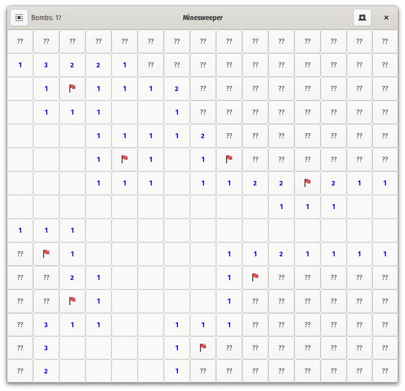

# Minesweeper

## This is my little project to get into learning GTK with Vala



## Dependencies

This project uses system icons which may or may not exist with the same name -
or at all - on your system.

- Vala
- GTK4
- Meson
- ninja
- pkg-config

For development also install the Vala Language Server.

### For Development with Nix

*Note: This step is not required if you are also building it with Nix. Then
simply skip ahead to the build instructions.*

*Note: This includes the Vala Language Server as well.*

```sh
nix-shell
```

### Void Linux

```sh
sudo xbps-install -S gcc vala cmake meson ninja pkg-config gtk4-devel
```

### Fedora Linux

```sh
sudo dnf install gcc vala cmake meson ninja-build pkg-config gtk4-devel
```

## Build instructions

### With Nix

1. Clone this repo

   ```sh
   git clone https://github.com/kintrix007/minesweeper.git
   ```

2. Build it

   ```sh
   nix-build
   # Or, to build it with the alternate CLI-only UI
   nix-build --arg cliOnly true
   ```

3. Install the package globally (optional)

   ```sh
   nix-env -i ./result
   ```

The built derivation will be symlinked as `result` in the current working
directory.

### With Meson

1. Clone this repo

   ```sh
   git clone https://github.com/kintrix007/minesweeper.git
   ```

2. Install dependencies

3. Set up build directory

   ```sh
   meson setup builddir
   # Or to build with the alternate CLI-only UI
   meson setup builddir -Dcli_only=true
   ```

4. Compile the code

   ```sh
   meson compile -C builddir
   ```

   You are done. The executable is located at `builddir/minesweeper`.

5. Install the binaries globally (optional)

   ```sh
   meson install -C builddir
   ```
